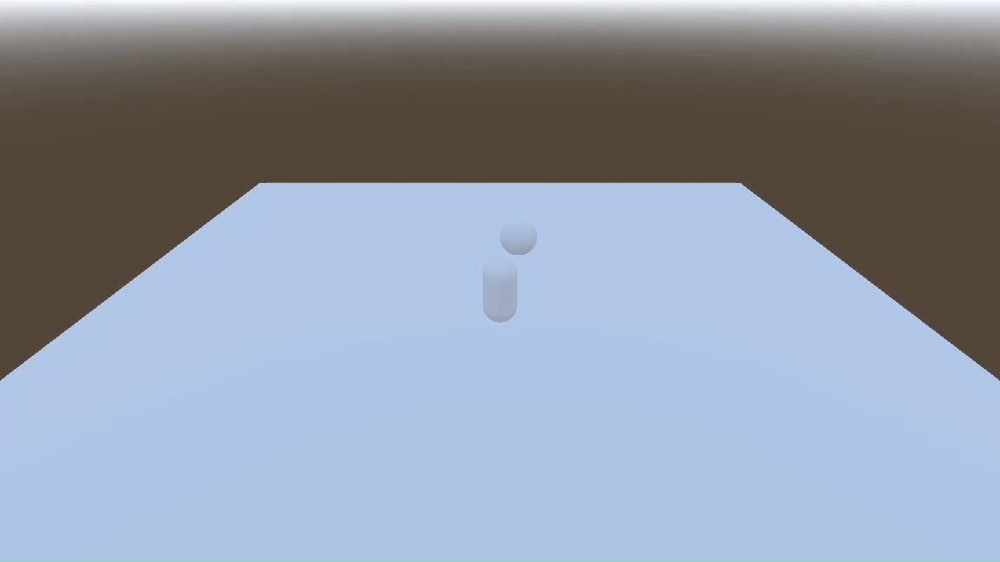
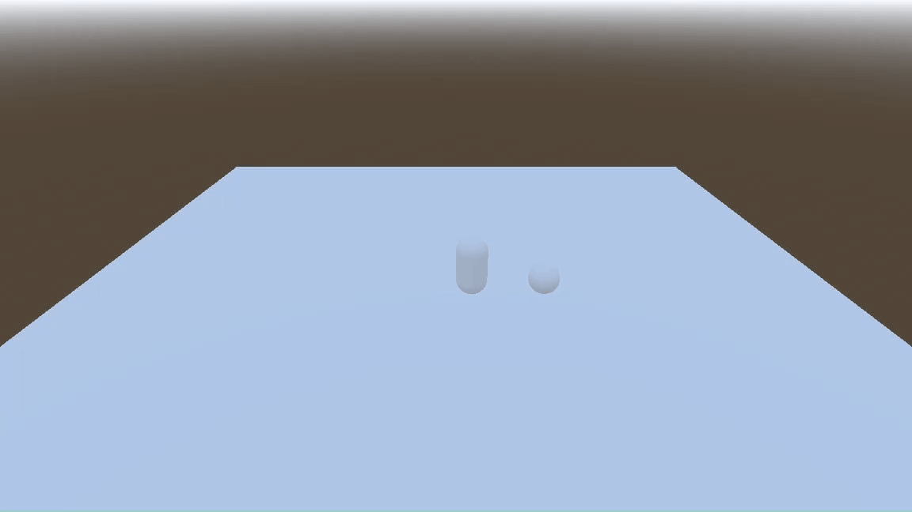

# @ryannhg/godot-soccer-demo
> A basic example of pushing a ball around!

## Context

For my game, I wanted to learn how to push around a soccer ball. 

At first, my player was fully stopping when they hit the soccer ball, and
as a result, it wasn't moving very far:

I asked for help in the [Godot Community Discord](https://discord.com/invite/zH7NUgz), and a community member pointed
me in the right direction:

> you can put the ball on collision layer 2 exclusively, that should fix it
> your characterbody only masks layer 1 by default so it wont be colliding against the ball (stopping) but still push it

Here's a basic demo of how to push around a soccer ball. The trick is to make sure that "Ball" is on
collision layer 2:

( Thank you `@Codimon` for your help! 💖 )
